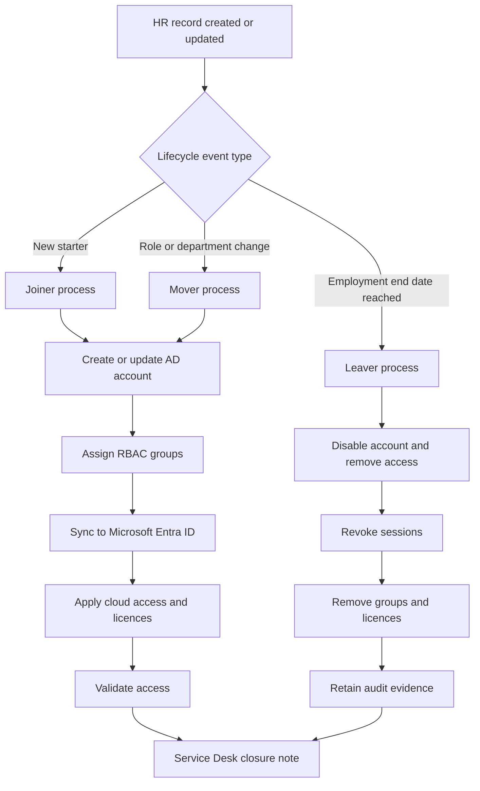

# 01 - Identity Lifecycle Management: Joiner, Mover, Leaver (JML)

## Project Overview

This project documents a complete **Identity Lifecycle Management** process for a hybrid identity environment using **HR as the source of truth**, **Active Directory as the primary on-premises directory**, and **Microsoft Entra ID** as the cloud identity platform.

The project demonstrates how an organisation can manage the full user lifecycle:

- **Joiner**: create a new identity from an approved HR record
- **Mover**: update access when an employee changes role, department, manager, or location
- **Leaver**: disable access quickly and safely when employment ends

The aim is to show practical IAM thinking, not just account creation. The process focuses on governance, security, auditability, least privilege, and operational handover to Service Desk teams.

---

## Business Problem

In many organisations, user access is created manually by Service Desk or IT Operations. This can lead to:

- Late account creation for new starters
- Users receiving access they do not need
- Old access remaining after role changes
- Leavers retaining access longer than necessary
- Poor audit evidence during access reviews
- Inconsistent handling of urgent terminations

This project solves those problems by designing a clear JML process that connects HR data, identity creation, role-based access, approval, provisioning, and evidence collection.

---

## Target Environment

This project is designed around a realistic hybrid identity model:

| Layer | Technology / Process |
|---|---|
| HR source of truth | HR system or HR-managed CSV export |
| Identity engine | Script-based integration or workflow engine |
| On-prem directory | Active Directory Domain Services |
| Cloud directory | Microsoft Entra ID |
| Synchronisation | Microsoft Entra Connect Sync / Cloud Sync |
| Access model | RBAC using AD groups and Entra groups |
| Governance | Access reviews, approval records, audit logs |
| Operations | Service Desk runbooks and test evidence |

Example lab domain used in this project:

```text
ad.iamhomelab.com
```

---

## What This Project Demonstrates

By reviewing this project, a hiring manager should see that I understand:

- HR-driven identity lifecycle design
- Joiner, Mover, Leaver controls
- Hybrid AD and Microsoft Entra identity flow
- RBAC group assignment principles
- Least privilege access design
- Approval and audit evidence requirements
- Operational handover through runbooks
- IAM risks such as orphaned accounts and access creep
- How Service Desk, HR, Line Managers, and IAM teams interact

---

## Repository Structure

```text
01-identity-lifecycle-jml/
├── README.md
├── jml-process-flow.md
├── hr-source-of-truth-design.md
├── joiner-process.md
├── mover-process.md
├── leaver-process.md
├── test-evidence.md
└── screenshots/
    ├── README.md
    └── .gitkeep
```

---

## JML Lifecycle Summary

### 1. Joiner

A new starter record is created or approved in HR. The identity process validates the record, creates the AD account, assigns baseline access, syncs the account to Entra ID, applies cloud access, and confirms readiness before the user starts.

### 2. Mover

When a user changes department, job title, manager, or location, old access is removed before new access is added. This reduces access creep and ensures the user only keeps access required for their new role.

### 3. Leaver

When a user leaves the organisation, the account is disabled, sessions are revoked, group access is removed, licences are reclaimed, mailbox/data handling is completed, and evidence is retained for audit.

---

## High-Level Process Diagram



---

## Controls Included

| Control | Purpose |
|---|---|
| HR source of truth | Prevents IT from creating unauthorised identities |
| Mandatory HR fields | Ensures identities are created consistently |
| Manager approval | Confirms role and access requirement |
| RBAC group mapping | Standardises access by department and job role |
| Remove-before-add mover process | Reduces access creep |
| Immediate disable for leavers | Reduces risk of unauthorised access |
| Session revocation | Stops active cloud sessions after disablement |
| Licence reclamation | Reduces unnecessary M365 licence cost |
| Evidence capture | Supports audit, compliance, and troubleshooting |

---

## Success Criteria

The project is successful when:

- A new starter can be created from HR data with the correct baseline access
- A mover loses previous department access before receiving new access
- A leaver is disabled and removed from access groups within the expected SLA
- Entra ID reflects the on-premises AD state after synchronisation
- Evidence exists for each lifecycle event
- Service Desk can follow the process without relying on undocumented knowledge

---

## Key Skills Demonstrated

- Identity and Access Management
- Microsoft Entra ID
- Active Directory
- Hybrid Identity
- RBAC Design
- JML Process Design
- Access Governance
- PowerShell Process Automation Design
- Audit Evidence Collection
- Service Desk Operational Improvement

---

## Suggested Screenshots to Add

Add screenshots to the `screenshots/` folder as the lab is built or tested:

- HR source CSV sample
- AD user before and after creation
- AD group membership
- Entra ID synced user
- Assigned licences
- Dynamic or assigned group membership
- Mover access before and after
- Disabled leaver account in AD
- Revoked sessions in Entra ID
- Audit log or ticket closure evidence

---

## Project Status

```text
Status: Portfolio documentation complete
Next step: Add lab screenshots and test results
```
