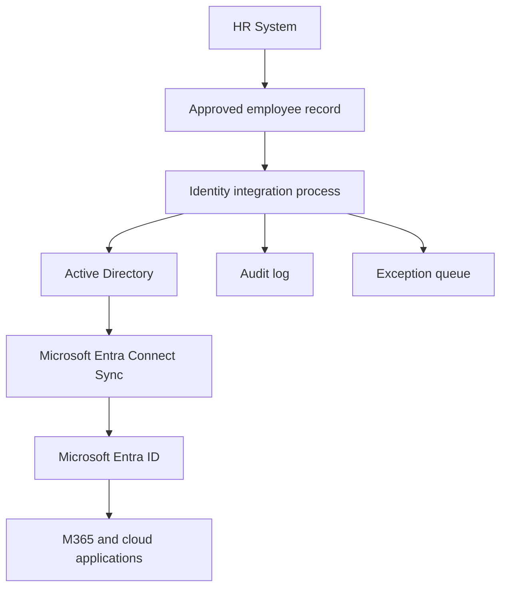

# HR Source of Truth Design

## Purpose

This document defines how HR data should be used as the authoritative source for identity lifecycle events.

The HR record determines whether a user should exist, what department they belong to, who manages them, when they start, when they leave, and what basic role-based access they should receive.

---

## Design Principle

The core principle is:

```text
No approved HR record = no standard employee identity
```

This prevents IT from creating accounts based on informal messages, unapproved requests, or incomplete information.

---

## Source of Truth Model



---

## Authoritative Fields

| Field | Source | Used For | Required |
|---|---|---|---|
| Employee ID | HR | Unique join between HR and IAM records | Yes |
| First Name | HR | Account naming and display name | Yes |
| Last Name | HR | Account naming and display name | Yes |
| Preferred Name | HR | Display name where applicable | Optional |
| Start Date | HR | Joiner trigger and enablement date | Yes |
| End Date | HR | Leaver trigger and disablement date | Conditional |
| Employment Status | HR | Active, pending, leaver, suspended | Yes |
| Department | HR | RBAC mapping and OU placement | Yes |
| Job Title | HR | Role-based access mapping | Yes |
| Manager | HR | Approval, ownership, and reporting line | Yes |
| Office / Location | HR | Location-based access and address lists | Yes |
| Contract Type | HR | Determines access level and expiry | Yes |
| Work Email | IAM generated or HR confirmed | UPN/mail attribute | Conditional |

---

## Example HR Input Record

```csv
EmployeeID,FirstName,LastName,PreferredName,StartDate,EndDate,EmploymentStatus,Department,JobTitle,ManagerEmail,Office,ContractType
EMP1001,Amina,Yusuf,Amina,2026-07-01,,Active,Finance,Finance Analyst,manager@iamhomelab.com,Milton Keynes,Permanent
```

---

## Identity Attribute Mapping

| HR Field | AD Attribute | Entra ID Attribute | Example |
|---|---|---|---|
| EmployeeID | employeeID | employeeId | EMP1001 |
| FirstName | givenName | givenName | Amina |
| LastName | sn | surname | Yusuf |
| FirstName + LastName | displayName | displayName | Amina Yusuf |
| Generated username | sAMAccountName | onPremisesSamAccountName | ayusuf |
| Generated UPN | userPrincipalName | userPrincipalName | ayusuf@iamhomelab.com |
| Department | department | department | Finance |
| JobTitle | title | jobTitle | Finance Analyst |
| Manager | manager | manager | manager@iamhomelab.com |
| Office | physicalDeliveryOfficeName | officeLocation | Milton Keynes |
| ContractType | extensionAttribute1 | employeeType | Permanent |

---

## Naming Convention

### Username

Preferred format:

```text
firstinitiallastname
```

Example:

```text
Amina Yusuf -> ayusuf
```

If the username already exists, append a number:

```text
ayusuf2
```

### UPN

```text
username@iamhomelab.com
```

Example:

```text
ayusuf@iamhomelab.com
```

### Display Name

```text
FirstName LastName
```

Example:

```text
Amina Yusuf
```

---

## OU Placement Design

Example AD OU structure:

```text
DC=ad,DC=iamhomelab,DC=com
└── OU=OGKAREEMU
    ├── OU=USERS
    │   ├── OU=Finance
    │   ├── OU=HR
    │   ├── OU=IT
    │   └── OU=Operations
    ├── OU=Disabled Users
    ├── OU=Service Accounts
    └── OU=Groups
```

Recommended placement rule:

| User Type | OU |
|---|---|
| Active employee | Department OU under `OU=USERS` |
| Contractor | Contractor OU or department OU with expiry attribute |
| Leaver | `OU=Disabled Users` |
| Service account | `OU=Service Accounts` |

---

## RBAC Mapping Design

Access should be assigned through groups, not directly on user objects.

Example mapping:

| Department | Job Role | Baseline Group | Role Group | Cloud Group |
|---|---|---|---|---|
| Finance | Finance Analyst | GG_All_Employees | GG_FIN_Analysts | Entra-Finance-M365-Standard |
| HR | HR Advisor | GG_All_Employees | GG_HR_Advisors | Entra-HR-M365-Standard |
| IT | Service Desk Analyst | GG_All_Employees | GG_IT_ServiceDesk | Entra-IT-M365-Standard |
| IT | IAM Analyst | GG_All_Employees | GG_IT_IAM_Analysts | Entra-IAM-Admin-Eligible |

---

## Group Naming Standard

| Prefix | Meaning | Example |
|---|---|---|
| GG | Global Group for users with similar role or department | GG_FIN_Analysts |
| DL | Domain Local Group used to assign permissions to resources | DL_FS_Finance_RW |
| APP | Application access group | APP_ServiceNow_ITIL |
| LIC | Licence assignment group | LIC_M365_E3 |
| CA | Conditional Access targeting group | CA_Require_MFA_Admins |
| PIM | Privileged access group | PIM_Entra_UserAdmin_Eligible |

---

## Data Validation Rules

Before provisioning, the identity process should validate:

- Employee ID is unique
- First name and last name are populated
- Start date is valid
- Employment status is approved or active
- Department exists in the RBAC mapping table
- Manager exists or has an approved placeholder
- Job title maps to an approved access profile
- Contract end date exists for contractors
- UPN is unique

---

## Joiner Eligibility Logic

```text
IF EmploymentStatus = Active or PreHire
AND StartDate is within approved onboarding window
AND mandatory fields are complete
THEN create identity
ELSE place record in exception queue
```

---

## Mover Detection Logic

A mover event should be triggered when any of the following fields change:

- Department
- Job title
- Manager
- Office/location
- Contract type
- Employment status

The most important mover controls are department and job title changes because these usually affect access.

---

## Leaver Detection Logic

A leaver event should be triggered when:

```text
EmploymentStatus = Leaver
OR EndDate <= Today
OR HR sends emergency termination request
```

Emergency leavers should bypass standard scheduled processing and be disabled immediately.

---

## Error and Exception Handling

| Issue | Action |
|---|---|
| Missing department | Hold provisioning and ask HR to correct record |
| Duplicate employee ID | Stop processing and investigate |
| Duplicate UPN | Generate alternate username and log change |
| Missing manager | Assign temporary manager or hold sensitive access |
| Unknown job title | Assign baseline access only and request access approval |
| Contractor without end date | Reject or escalate to HR |

---

## Audit Requirements

The identity process should log:

- HR record received
- Validation result
- Account created or updated
- Groups added
- Groups removed
- Licence assigned or removed
- Sync status
- Errors or exceptions
- Approver details
- Completion timestamp

---

## Security Considerations

- HR data should be transferred securely
- HR export files should be access-controlled
- Service accounts should use least privilege
- Scripts should not store passwords in plain text
- Logs should not expose temporary passwords
- Leaver events should be prioritised over joiner and mover events
- Privileged users should have additional review and faster disablement

---

## Outcome

Using HR as the source of truth creates a reliable identity lifecycle process where access is based on business records, not informal requests. This reduces unauthorised access, improves onboarding, and strengthens audit readiness.
