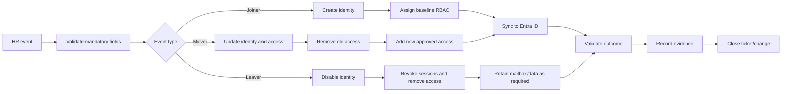
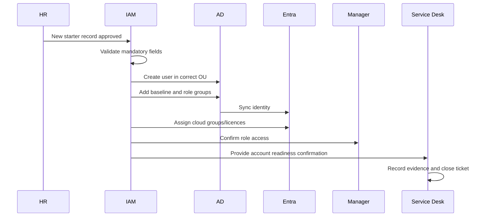
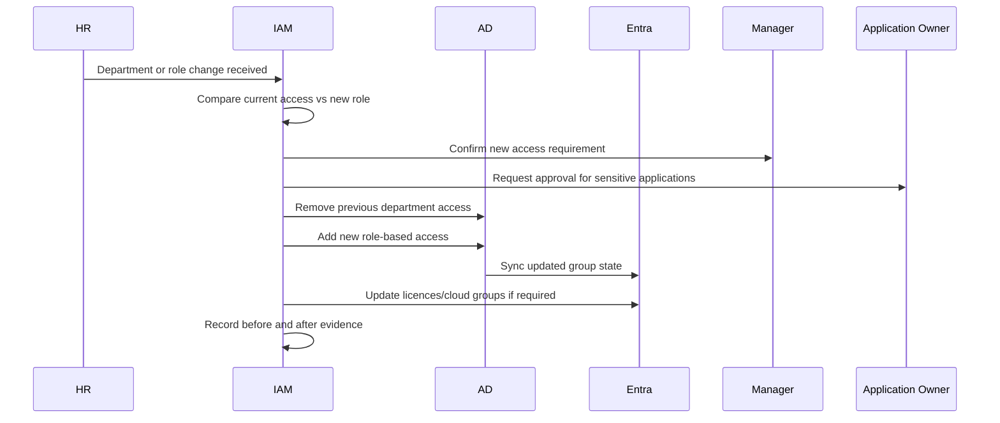
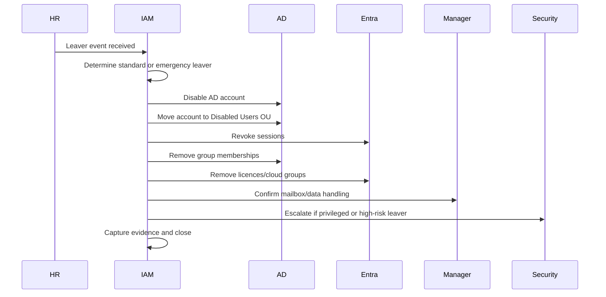

# JML Process Flow

## Purpose

This document explains the full Joiner, Mover, Leaver process flow for a hybrid IAM environment.

The goal is to ensure that every identity lifecycle event starts from an authorised HR record and ends with validated access, clear ownership, and audit evidence.

---

## Roles and Responsibilities

| Role | Responsibility |
|---|---|
| HR Team | Creates and updates employee records; confirms start dates, end dates, department, manager, and employment status |
| Line Manager | Confirms access requirements and validates role-specific access |
| Service Desk | Handles first-line checks, follows runbooks, validates common issues, and records evidence |
| IAM Team | Owns lifecycle process, RBAC mapping, access controls, exceptions, and governance |
| Infrastructure / AD Admin | Supports AD, GPO, OU, sync, and directory service issues |
| Application Owners | Approve and review access to business applications |
| Security Team | Reviews high-risk access, leaver incidents, privileged access, and audit exceptions |

---

## End-to-End Lifecycle Flow

---

## Trigger Events

| Event | Trigger Source | Example |
|---|---|---|
| Joiner | New HR record with future start date | New employee starting in Finance |
| Mover | HR update to department, title, manager, location, or contract type | User moves from Service Desk to IAM Team |
| Leaver | HR end date, resignation, contract end, termination | User leaves organisation on Friday |
| Emergency leaver | HR/Security urgent request | User must be disabled immediately |

---

## Identity Lifecycle States

| State | Meaning | Access Position |
|---|---|---|
| Pre-hire | HR record exists but start date has not arrived | No interactive access unless pre-boarding is approved |
| Active | Employee is active | Role-based access assigned |
| Mover pending | Role change is approved but not fully processed | Old access reviewed and removal scheduled |
| Suspended | Account temporarily disabled | No interactive access |
| Leaver | Employment ended | Account disabled and access removed |
| Archived | Retention period reached | Account removed or archived based on policy |

---

## Joiner Flow

---

## Mover Flow

---

## Leaver Flow

---

## Standard SLAs

| Lifecycle Event | Target SLA |
|---|---|
| Joiner account creation | At least 1 working day before start date |
| Joiner access validation | Before start of first working day |
| Standard mover | Within 1 working day of approved HR change |
| High-risk mover | Same day once approved |
| Standard leaver | Disable on final working day or agreed time |
| Emergency leaver | Immediate disable, target under 15 minutes |
| Privileged leaver | Immediate disable and security review |

---

## Key Control Points

### 1. HR must be the source of truth

IT should not create accounts based only on informal requests. A user identity should be created only when HR has created or approved the employee record.

### 2. Access must be role-based

Access should be assigned through approved groups mapped to department, job role, location, and application needs.

### 3. Mover access must be reviewed carefully

The mover process is one of the biggest sources of access creep. Old access should be removed before new access is added unless there is documented approval for temporary overlap.

### 4. Leaver actions must be fast and evidenced

The account disable action is the most important leaver control. Session revocation, group removal, licence removal, and mailbox handling should follow immediately after.

### 5. Exceptions must be documented

Any access outside the standard RBAC model must have a business justification, owner approval, expiry date, and review date.

---

## Exception Handling

| Exception | Required Action |
|---|---|
| Missing HR field | Reject or hold request until HR record is corrected |
| No manager assigned | Assign temporary owner or hold non-essential access |
| Urgent start | Create minimum access only and review after start |
| Temporary dual role | Approve overlap with expiry date |
| Privileged access request | Use PIM/JIT approval where available |
| Emergency termination | Disable first, investigate and document after |

---

## Audit Evidence Required

Each lifecycle event should include:

- HR trigger or ticket reference
- User identity details
- Requestor and approver
- Date and time processed
- Groups added
- Groups removed
- Licence changes
- Screenshots or logs showing before and after state
- Validation result
- Closure note

---

## Outcome

A well-designed JML process reduces security risk, improves onboarding experience, prevents access creep, and gives auditors clear evidence that identity lifecycle controls are working.
