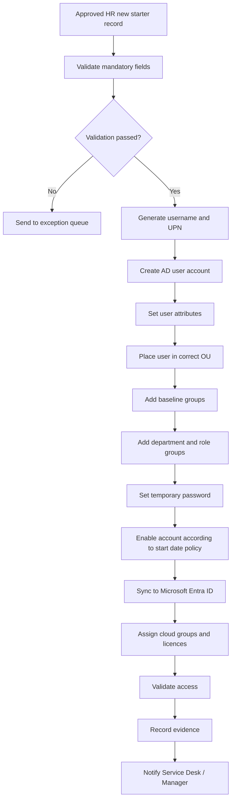

# Joiner Process

## Purpose

The Joiner process ensures that new employees receive the correct identity and access before their first working day.

The process starts with an approved HR record and ends with a validated account in Active Directory, Microsoft Entra ID, and required business applications.

---

## Joiner Objectives

The process must ensure that:

- New starter accounts are created only from approved HR records
- User attributes are accurate and consistent
- Access is based on department, job role, location, and contract type
- Access is assigned through groups, not direct permissions
- The account syncs successfully to Microsoft Entra ID
- The user has the correct licences and baseline access
- Evidence is captured before the ticket is closed

---

## Joiner Trigger

A Joiner event is triggered when HR creates or approves a new employee record.

Minimum required conditions:

```text
EmploymentStatus = Active or PreHire
StartDate is present
Department is present
Manager is present
JobTitle is present
EmployeeID is unique
```

---

## Process Flow



---

## Step-by-Step Procedure

### Step 1: Receive HR Record

The joiner process begins when HR provides a new starter record.

Required fields:

- Employee ID
- First name
- Last name
- Start date
- Department
- Job title
- Manager
- Office/location
- Contract type

---

### Step 2: Validate HR Data

Validation checks:

| Check | Expected Result |
|---|---|
| Employee ID is unique | No existing active user with same Employee ID |
| Name fields are populated | First name and last name exist |
| Start date is valid | Date is not blank or invalid |
| Department exists | Department maps to approved RBAC profile |
| Manager exists | Manager account exists and is active |
| Job title exists | Job title maps to access profile or exception path |
| Contract type is valid | Permanent, fixed-term, contractor, temporary |

If validation fails, the request should not proceed to full provisioning.

---

### Step 3: Generate Username and UPN

Example convention:

```text
First initial + surname
```

Example:

```text
Name: Amina Yusuf
Username: ayusuf
UPN: ayusuf@iamhomelab.com
Email: ayusuf@iamhomelab.com
```

If the username already exists:

```text
ayusuf2@iamhomelab.com
```

---

### Step 4: Create AD Account

The account should be created in the correct department OU.

Example:

```text
OU=Finance,OU=USERS,OU=OGKAREEMU,DC=ad,DC=iamhomelab,DC=com
```

Key attributes to set:

- givenName
- sn
- displayName
- sAMAccountName
- userPrincipalName
- mail
- employeeID
- department
- title
- manager
- company
- office
- description

---

### Step 5: Assign Baseline Groups

Every standard employee should receive baseline access.

Example baseline groups:

| Group | Purpose |
|---|---|
| GG_All_Employees | Standard employee group |
| LIC_M365_E3 | Microsoft 365 licence assignment |
| APP_Intranet_Users | Intranet access |
| APP_ServiceDeskPortal_Users | Self-service ticketing portal |
| CA_Require_MFA_AllUsers | Conditional Access MFA targeting |

---

### Step 6: Assign Department and Role Groups

Example for Finance Analyst:

| Access Type | Group |
|---|---|
| Department group | GG_FIN_All |
| Role group | GG_FIN_Analysts |
| File share read/write | DL_FS_Finance_RW |
| Finance app access | APP_FinanceSystem_Users |
| M365 standard licence | LIC_M365_E3 |

Access should be assigned through the RBAC mapping table, not manually guessed.

---

### Step 7: Password and First Sign-In Handling

Recommended approach:

- Generate a secure temporary password
- Require password change at next sign-in where appropriate
- Never store the temporary password in plain text logs
- Share password using an approved secure process
- For cloud access, enforce MFA registration or Temporary Access Pass if applicable

---

### Step 8: Sync to Microsoft Entra ID

After AD creation, the account should sync to Microsoft Entra ID.

Validation points:

- User appears in Entra ID
- UPN is correct
- Account source shows as synced from on-premises AD
- Department and job title are populated
- Group memberships are present
- Licence assignment is complete

---

### Step 9: Validate Access

Validation checks:

| Area | Check |
|---|---|
| AD | Account exists, enabled, correct OU |
| AD groups | Baseline and role groups assigned |
| Entra ID | User synced successfully |
| M365 | Licence assigned |
| MFA | User included in MFA policy scope |
| Applications | Required app groups assigned |
| Manager | Manager attribute populated |

---

## Joiner Checklist

| Task | Completed |
|---|---|
| HR record approved | ☐ |
| Mandatory fields validated | ☐ |
| Username and UPN generated | ☐ |
| AD account created | ☐ |
| Correct OU assigned | ☐ |
| Attributes populated | ☐ |
| Baseline groups assigned | ☐ |
| Role groups assigned | ☐ |
| Account synced to Entra ID | ☐ |
| Licence assigned | ☐ |
| MFA/access policies apply | ☐ |
| Evidence captured | ☐ |
| Manager/Service Desk notified | ☐ |

---

## Joiner Example

| Field | Value |
|---|---|
| Employee ID | EMP1001 |
| Name | Amina Yusuf |
| Department | Finance |
| Job Title | Finance Analyst |
| Manager | Sarah Johnson |
| Office | Milton Keynes |
| Contract Type | Permanent |
| Start Date | 2026-07-01 |
| Username | ayusuf |
| UPN | ayusuf@iamhomelab.com |

Expected access:

- GG_All_Employees
- GG_FIN_All
- GG_FIN_Analysts
- DL_FS_Finance_RW
- APP_FinanceSystem_Users
- LIC_M365_E3
- CA_Require_MFA_AllUsers

---

## Common Joiner Issues and Fixes

| Issue | Likely Cause | Fix |
|---|---|---|
| User not created | Missing mandatory HR field | Ask HR to correct record |
| Duplicate username | Existing account has same naming pattern | Generate alternate username |
| User not syncing to Entra | AD Connect sync issue or OU not in scope | Check sync scope and run delta sync |
| Licence not assigned | User missing licence group | Add correct licence assignment group |
| Manager missing | Manager account not found | Confirm manager with HR |
| Incorrect access | Wrong department/job title mapping | Review RBAC mapping table |

---

## Evidence to Capture

- HR source record or ticket reference
- AD account properties
- AD group membership
- Entra ID user profile
- Licence assignment
- MFA/Conditional Access scope where possible
- Completion note confirming account is ready

---

## Completion Criteria

A Joiner request is complete when:

- The user account exists in AD
- The user has the correct attributes
- The account has synced to Entra ID
- Baseline and role-based access are assigned
- Required licences are assigned
- Evidence is saved
- Service Desk or the hiring manager has been notified
