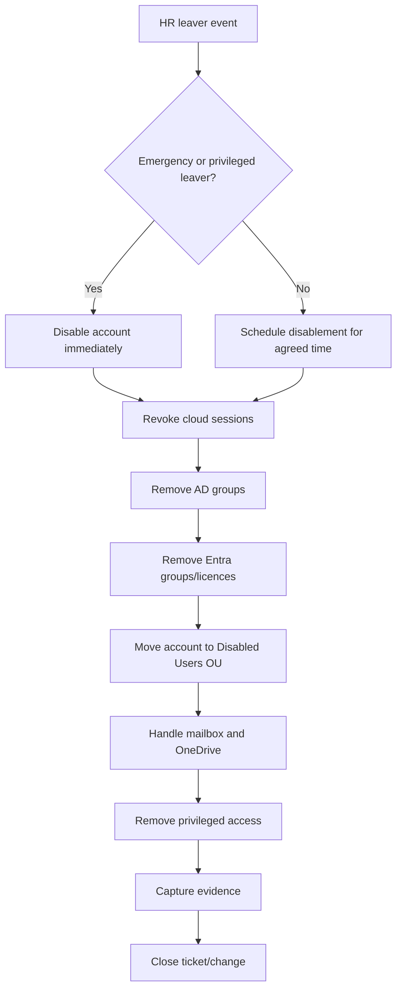

# Leaver Process

## Purpose

The Leaver process ensures that users who leave the organisation no longer have access to systems, applications, data, or cloud resources.

Leaver management is one of the most important IAM controls because a delayed or incomplete offboarding process can leave the organisation exposed to unauthorised access.

---

## Leaver Objectives

The process must ensure that:

- Leavers are disabled at the correct time
- Emergency leavers are disabled immediately
- Active cloud sessions are revoked
- Group memberships are removed
- Licences are reclaimed
- Mailbox and OneDrive data are handled according to business policy
- Privileged access is reviewed and removed quickly
- Evidence is captured for audit

---

## Leaver Types

| Leaver Type | Description | Priority |
|---|---|---|
| Standard leaver | Normal resignation or contract end | Normal |
| Fixed-term leaver | Contract reaches end date | Normal |
| Immediate leaver | HR requests same-day disablement | High |
| Emergency leaver | Security/HR requests urgent disablement | Critical |
| Privileged leaver | User has admin or sensitive access | Critical |

---

## Leaver Trigger

A Leaver event is triggered when:

```text
EmploymentStatus = Leaver
OR EndDate <= Today
OR HR/Security requests emergency disablement
```

---

## Process Flow



---

## Step-by-Step Procedure

### Step 1: Receive Leaver Notification

The process starts when HR provides one of the following:

- Employee end date
- Contract end date
- Immediate termination instruction
- Suspension instruction
- Emergency leaver request

The request should include:

- Employee name
- Employee ID
- UPN
- Department
- Manager
- Final working date and time
- Leaver type
- Mailbox/data handling instruction

---

### Step 2: Check Risk Level

Before processing, check if the user has sensitive access.

High-risk access includes:

- Entra admin roles
- Domain Admin or server admin access
- Privileged access groups
- Finance system access
- HR system access
- Security tooling access
- Service account ownership
- Shared mailbox owner/delegate access

Privileged leavers should be processed with higher urgency.

---

### Step 3: Disable AD Account

For hybrid environments where AD is the source of authority, the AD account should be disabled first.

Recommended actions:

- Disable AD account
- Reset password if required by policy
- Move account to Disabled Users OU
- Update description with leaver date and ticket reference
- Hide from address lists if required

Example description format:

```text
Disabled as leaver on 2026-07-01. Ticket: IAM-12345.
```

---

### Step 4: Revoke Cloud Sessions

After disabling the user, revoke cloud sessions to reduce the risk of continued access from existing browser or device sessions.

Cloud actions may include:

- Revoke Microsoft Entra user sessions
- Revoke refresh tokens
- Block sign-in if cloud-only attributes are managed separately
- Confirm account is disabled in Entra ID after sync

---

### Step 5: Remove Group Access

Remove access groups from the user.

Priority removal groups:

| Group Type | Example |
|---|---|
| Privileged groups | PIM_Entra_UserAdmin_Eligible |
| Department groups | GG_FIN_All |
| Role groups | GG_FIN_Analysts |
| File share groups | DL_FS_Finance_RW |
| Application groups | APP_FinanceSystem_Users |
| Licence groups | LIC_M365_E3 |

Some organisations retain a minimal leaver group or disabled account marker group for reporting.

---

### Step 6: Remove Licences

Licences should be reclaimed once mailbox/data handling requirements are confirmed.

Typical process:

1. Convert mailbox to shared mailbox if required
2. Apply retention policy if required
3. Remove Microsoft 365 licence
4. Record licence removal evidence

---

### Step 7: Mailbox and Data Handling

Mailbox and OneDrive actions should follow business policy and manager approval.

Common actions:

| Requirement | Action |
|---|---|
| Manager needs mailbox access | Convert to shared mailbox or delegate access according to policy |
| Mail forwarding required | Apply approved forwarding with expiry date |
| OneDrive files required | Transfer ownership or grant manager access |
| No data retention needed | Follow standard retention/deletion policy |

Mailbox forwarding should always have a clear business reason and expiry date.

---

### Step 8: Remove Privileged Access

For privileged users, review and remove:

- Entra admin role assignments
- PIM eligible assignments
- AD admin group memberships
- Local admin rights
- Application admin roles
- Break-glass exclusions if any
- API/application ownership if applicable

Privileged leavers should also be reviewed by Security.

---

### Step 9: Validate Final State

Validation checks:

| Area | Expected Result |
|---|---|
| AD | Account disabled |
| AD OU | User moved to Disabled Users OU |
| AD groups | Access groups removed |
| Entra ID | Account disabled after sync |
| Sessions | Cloud sessions revoked |
| Licences | Removed or retained only with approved reason |
| Mailbox | Converted/delegated/retained according to policy |
| Privileged access | Removed |

---

## Emergency Leaver Procedure

For emergency leavers, the order changes:

```text
1. Disable account immediately
2. Revoke sessions immediately
3. Remove privileged access immediately
4. Notify Security/IAM lead
5. Complete group/licence/mailbox cleanup
6. Document evidence after containment
```

The principle is:

```text
Contain first, document immediately after.
```

---

## Leaver Checklist

| Task | Completed |
|---|---|
| HR leaver notification received | ☐ |
| Final working date/time confirmed | ☐ |
| Risk level checked | ☐ |
| AD account disabled | ☐ |
| Password reset if required | ☐ |
| Account moved to Disabled Users OU | ☐ |
| Cloud sessions revoked | ☐ |
| AD groups removed | ☐ |
| Entra groups removed | ☐ |
| Licences removed or retained with reason | ☐ |
| Mailbox handling completed | ☐ |
| OneDrive/data handling completed | ☐ |
| Privileged access removed | ☐ |
| Evidence captured | ☐ |
| Ticket/change closed | ☐ |

---

## Example Leaver Scenario

| Field | Value |
|---|---|
| Name | Amina Yusuf |
| Username | ayusuf |
| Department | Finance |
| Job Title | Finance Analyst |
| Final Working Date | 2026-07-01 |
| Leaver Type | Standard leaver |
| Manager | Sarah Johnson |
| Ticket | IAM-12345 |

### Actions Completed

| Action | Result |
|---|---|
| Disable AD account | Completed |
| Move to Disabled Users OU | Completed |
| Revoke Entra sessions | Completed |
| Remove Finance groups | Completed |
| Remove M365 licence | Completed after mailbox review |
| Convert mailbox | Completed if manager approved |
| Capture evidence | Completed |

---

## Common Leaver Issues and Fixes

| Issue | Likely Cause | Fix |
|---|---|---|
| User still signs in | Session not revoked or cloud account not disabled | Revoke sessions and verify sync |
| Account re-enabled in Entra | On-prem AD still active | Disable account in AD source of authority |
| Licence still assigned | Licence group not removed | Remove licence group or direct licence |
| User retains app access | App group not removed | Review all group memberships |
| Manager asks for mailbox late | Data handling not confirmed early | Add manager confirmation to leaver form |
| Privileged access remains | Admin role not reviewed | Check PIM, Entra roles, AD admin groups |

---

## Evidence to Capture

- HR leaver request or ticket reference
- AD disabled account screenshot
- Disabled Users OU placement
- Group removal evidence
- Entra ID disabled account state
- Session revocation evidence
- Licence removal evidence
- Mailbox/OneDrive action evidence
- Privileged access removal evidence
- Ticket closure note

---

## Completion Criteria

A Leaver request is complete when:

- The account is disabled in the authoritative directory
- Cloud sessions are revoked
- User access groups are removed
- Privileged access is removed
- Licences are removed or retained with approval
- Mailbox/data handling is complete
- Evidence is saved
- The ticket or change record is closed
