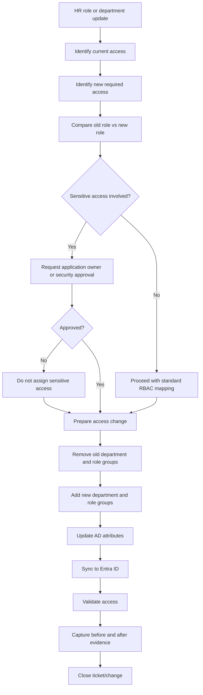

# Mover Process

## Purpose

The Mover process manages access changes when an employee changes role, department, manager, office, contract type, or employment status.

Mover events are high-risk because users may accidentally retain access from their old role while receiving access for their new role. This is known as **access creep**.

The main goal of this process is:

```text
Remove old access before adding new access, unless temporary overlap is approved and documented.
```

---

## Mover Objectives

The process must ensure that:

- HR remains the source of truth for role and department changes
- Old department and role access is removed
- New access is approved and assigned through groups
- Temporary dual access is time-bound and documented
- Sensitive access is approved by the correct owner
- Evidence is captured before and after the change

---

## Mover Trigger

A Mover event is triggered when one or more of the following HR fields change:

- Department
- Job title
- Manager
- Office/location
- Contract type
- Employment status

---

## Mover Risk

The biggest risk in a mover process is that users accumulate access over time.

Example:

```text
A user moves from Finance to IT.
If Finance access is not removed, the user may keep access to payroll, invoices, or financial records while also receiving IT access.
```

This violates least privilege and creates audit risk.

---

## Process Flow



---

## Step-by-Step Procedure

### Step 1: Receive HR Change

The mover process begins when HR updates the employee record.

Example change:

| Field | Before | After |
|---|---|---|
| Department | Finance | IT |
| Job Title | Finance Analyst | IAM Analyst |
| Manager | Finance Manager | IT Security Manager |
| Office | Milton Keynes | Milton Keynes |

---

### Step 2: Review Current Access

Before making any change, capture the user's current access.

Review:

- AD group membership
- Entra ID group membership
- Application access groups
- Licence groups
- Privileged role eligibility
- Shared mailbox access
- File share access

---

### Step 3: Map New Role Access

Use the RBAC mapping table to determine required access for the new role.

Example:

| New Role | Required Groups |
|---|---|
| IAM Analyst | GG_All_Employees, GG_DEPT_IT_All, GG_IT_IAM_Analysts, APP_ServiceNow_ITIL, PIM_Entra_UserAdmin_Eligible |

---

### Step 4: Identify Access to Remove

Remove access linked to the old department or role.

Example Finance access to remove:

- GG_FIN_All
- GG_FIN_Analysts
- DL_FS_Finance_RW
- APP_FinanceSystem_Users

---

### Step 5: Approval for Sensitive Access

Some access should not be assigned automatically.

Examples:

| Access Type | Approval Required |
|---|---|
| Privileged Entra role | IAM Manager or Security Manager |
| Finance system admin | Finance Application Owner |
| HR system access | HR System Owner |
| Production server access | Infrastructure Manager |
| Mailbox delegation | Mailbox owner or manager |

---

### Step 6: Remove Old Access

The safest mover model is:

```text
1. Remove previous department/role groups
2. Add new approved groups
3. Validate final access state
```

This avoids users retaining old permissions accidentally.

---

### Step 7: Add New Access

Add only the groups required for the new department and role.

Example new IAM Analyst access:

| Group | Purpose |
|---|---|
| GG_All_Employees | Standard employee access |
| GG_IT_All | IT department access |
| GG_IT_IAM_Analysts | IAM analyst access profile |
| APP_ServiceNow_ITIL | ITSM queue access |
| APP_Entra_AdminPortal_ReadOnly | Read-only identity administration |
| PIM_Entra_UserAdmin_Eligible | Eligible privileged access through PIM |

---

### Step 8: Update User Attributes

Update identity attributes to match HR:

- Department
- Title
- Manager
- Office
- Description
- Extension attributes if used for lifecycle status

---

### Step 9: Validate Sync and Access

Validation checks:

| Area | Expected Result |
|---|---|
| AD | User attributes updated |
| AD groups | Old role groups removed, new role groups added |
| Entra ID | Updated attributes visible after sync |
| Cloud groups | Correct cloud groups assigned |
| Licences | Correct licences retained or changed |
| Privileged access | Eligible only if approved |
| Applications | Access matches new role |

---

## Mover Checklist

| Task | Completed |
|---|---|
| HR change received | ☐ |
| Current access captured | ☐ |
| New role access mapped | ☐ |
| Old access identified | ☐ |
| Sensitive access approval completed | ☐ |
| Old groups removed | ☐ |
| New groups added | ☐ |
| User attributes updated | ☐ |
| Entra sync verified | ☐ |
| Access validated | ☐ |
| Evidence captured | ☐ |
| Ticket/change closed | ☐ |

---

## Example Mover Scenario

### User Details

| Field | Value |
|---|---|
| Name | Amina Yusuf |
| Username | amina.yusuf |
| Previous Department | Finance |
| New Department | IT |
| Previous Role | Finance Analyst |
| New Role | IAM Analyst |

### Access Removed

| Group | Reason |
|---|---|
| GG_FIN_All | No longer in Finance |
| GG_DEPT_FINANCE_ASSOCIATE | No longer Finance Analyst |
| DL_FS_Finance_READ | Finance file share no longer required |
| APP_FinanceSystem_Users | Finance system no longer required |

### Access Added

| Group | Reason |
|---|---|
| GG_IT_All | IT department access |
| GG_IT_IAM_Analysts | IAM role access |
| APP_ServiceNow_ITIL | ITSM access |
| APP_Entra_AdminPortal_ReadOnly | Identity admin read-only access |
| PIM_Entra_UserAdmin_Eligible | Privileged access eligibility, subject to approval |

---

## Temporary Dual Access

Sometimes a user may need temporary access to both old and new roles during handover.

This should only be allowed when:

- Manager approves the overlap
- Application owner approves sensitive access
- An expiry date is set
- The exception is reviewed
- The access is removed automatically or tracked manually

Example:

| Field | Value |
|---|---|
| User | aminayusuf |
| Old Access Retained | APP_FinanceSystem_Users |
| Reason | Two-week handover |
| Approved By | Finance Manager |
| Expiry Date | 2026-07-15 |
| Review Owner | IAM Team |

---

## Common Mover Issues and Fixes

| Issue | Likely Cause | Fix |
|---|---|---|
| User keeps old access | Old groups not removed | Compare against previous access and remove old groups |
| New access missing | RBAC mapping incomplete | Update RBAC table and request approval |
| Manager incorrect | HR record not updated | Ask HR to correct manager field |
| Cloud access delayed | Sync delay | Check Entra Connect sync status |
| Privileged role assigned directly | Poor access control design | Convert to PIM eligible access where possible |

---

##Screenshots

- HR change record or ticket reference
- Before group membership
- After group membership
- Approval for sensitive access
- Old access removed
- New access added
- Updated AD attributes
- Updated Entra ID profile
- Completion note

---

## Completion Criteria

A Mover request is complete when:

- Old role access has been removed
- New approved role access has been added
- HR-driven identity attributes are updated
- Entra ID reflects the updated identity state
- Any temporary exceptions have expiry dates
- Evidence is saved
- The ticket or change record is closed
