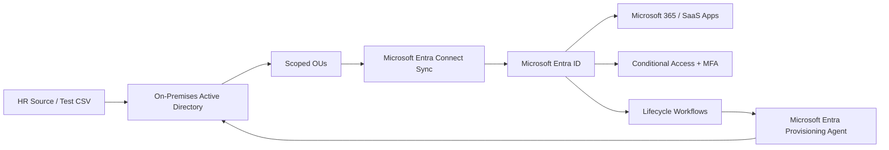
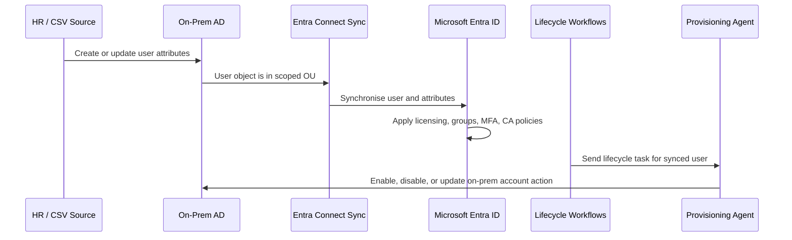

# Hybrid Identity Lab: Active Directory + Microsoft Entra ID

## Project Summary

This project documents a hybrid identity lab that connects an on-premises Active Directory Domain Services environment to Microsoft Entra ID using Microsoft Entra Connect Sync. The lab also includes a verified custom domain, `ogkareemu.live`, and the Microsoft Entra provisioning agent to support Lifecycle Workflows actions against synchronised on-premises users.

The aim of this project is to demonstrate practical hybrid IAM knowledge across directory synchronisation, custom domain planning, source-of-truth design, identity lifecycle operations, and troubleshooting.

---

## Why This Project Matters

Many organisations still operate in a hybrid identity model where users are created and managed in on-premises Active Directory, then synchronised to Microsoft Entra ID for Microsoft 365, SaaS access, Conditional Access, MFA, and governance controls.

This project highlights my understanding of:

- How on-premises AD and Microsoft Entra ID work together.
- Why the on-premises directory is commonly treated as the source of authority in hybrid environments.
- How custom domain and UPN alignment affects sign-in experience.
- How Microsoft Entra Connect Sync synchronises users, groups, and selected attributes.
- How Lifecycle Workflows can be extended to synchronise AD users using an on-premises provisioning agent.
- How to troubleshoot common sync and provisioning issues.

---

## Lab Objectives

The objectives of this lab were to:

1. Build an on-premises Active Directory domain.
2. Configure a custom routable domain for Entra sign-in: `ogkareemu.live`.
3. Add the custom domain as a UPN suffix in Active Directory.
4. Create test users in AD with cloud-ready UPNs.
5. Install and configure Microsoft Entra Connect Sync.
6. Synchronise selected users and groups to Microsoft Entra ID.
7. Validate that users appear correctly in Entra ID as synchronised identities.
8. Install the Microsoft Entra provisioning agent for on-premises lifecycle operations.
9. Configure Lifecycle Workflows for joiner, mover, or leaver use cases where applicable.
10. Document troubleshooting steps and operational checks.

---

## High-Level Architecture



---

## Lab Components

| Component | Purpose |
|---|---|
| Active Directory Domain Services | Primary on-premises identity store |
| Custom domain `ogkareemu.live` | Cloud-ready sign-in domain for Entra users |
| AD UPN suffix | Allows AD users to sign in with the same UPN as Entra ID |
| Microsoft Entra Connect Sync | Synchronises AD identities into Microsoft Entra ID |
| Microsoft Entra ID | Cloud identity platform for Microsoft 365 and governance |
| Microsoft Entra provisioning agent | Enables cloud-managed provisioning actions into on-premises systems |
| Lifecycle Workflows | Automates joiner, mover, and leaver identity tasks |
| Conditional Access | Applies Zero Trust access controls after identities are synchronised |

---

## Repository Structure

```text
02-hybrid-identity-ad-entra/
├── README.md
├── architecture.md
├── entra-connect-sync.md
```

---

## Identity Flow



---

## Key Design Decisions

### 1. AD is the primary source of authority

In this lab, user accounts are created and updated in Active Directory first. Microsoft Entra ID receives the synchronised identity through Entra Connect Sync. This reflects many real-world enterprise environments where HR or IT creates users on-premises before granting cloud access.

### 2. Use a verified routable domain for user sign-in

The domain `ogkareemu.live` is used as the user-facing UPN domain. This avoids a poor user experience where users sign in with an internal-only domain such as `.local`.

Example:

```text
AD logon name:  jane.doe@ogkareemu.live
Entra UPN:      jane.doe@ogkareemu.live
Primary email:  jane.doe@ogkareemu.live
```

### 3. Use OU scoping for safer synchronisation

Only lab users and groups in selected OUs are synchronised. This prevents accidental synchronisation of unnecessary or service accounts.

### 4. Use a dedicated sync server

The Entra Connect Sync server should be treated as a Tier 0 identity system because it has privileged access to identity data.

### 5. Use the provisioning agent for on-premises Lifecycle Workflow actions

Lifecycle Workflows can govern synchronised AD users. For on-premises account tasks, the Microsoft Entra provisioning agent provides the secure path from Entra to the on-premises environment.

---

## Example Lab Naming Standard

| Object Type | Example |
|---|---|
| AD domain | `ad.iamhomelab.local` or lab equivalent |
| Cloud custom domain | `ogkareemu.live` |
| Test user UPN | `john.smith@ogkareemu.live` |
| Sync OU | `OU=HybridUsers,DC=ad,DC=iamhomelab,DC=local` |
| Groups OU | `OU=Groups,DC=ad,DC=iamhomelab,DC=local` |
| Service account | `svc-entra-sync` |
| Provisioning agent server | `HYB-AGENT-01` |

---

## Example Test Users

| User | Department | AD UPN | Expected Entra State |
|---|---|---|---|
| John Smith | IT | `john.smith@ogkareemu.live` | Synced user |
| Amara Okafor | Finance | `amara.okafor@ogkareemu.live` | Synced user |
| David Brown | HR | `david.brown@ogkareemu.live` | Synced user |
| Sarah Jones | Operations | `sarah.jones@ogkareemu.live` | Synced user |

---

## Skills Demonstrated

- Hybrid identity architecture
- Active Directory administration
- Microsoft Entra ID administration
- Custom domain and UPN planning
- Entra Connect Sync configuration
- OU filtering and sync scoping
- Attribute synchronisation troubleshooting
- Lifecycle Workflow design
- On-premises provisioning agent deployment
- Identity lifecycle management
- Zero Trust readiness
- Technical documentation

---

## Evidence to be Captured

Recommended evidence includes:

1. Custom domain `ogkareemu.live` verified in Microsoft Entra ID.
2. AD Domains and Trusts showing `ogkareemu.live` as a UPN suffix.
3. Example AD user with `userPrincipalName` set to `@ogkareemu.live`.
4. Entra Connect Sync configuration page.
5. Synchronisation Service Manager showing successful export to Entra ID.
6. Entra ID user profile showing `On-premises sync enabled: Yes`.
7. Provisioning agent health status.
8. Lifecycle Workflow configuration targeting synchronised users.
9. Leaver test showing on-prem account disabled through workflow or validated manual process.
10. Sign-in test with synced user.

---

## Project Outcome

The lab successfully demonstrates a realistic hybrid IAM pattern:

- Users originate from on-premises Active Directory.
- Users use a verified custom UPN domain matching the Entra sign-in domain.
- Entra Connect Sync synchronises scoped users to Microsoft Entra ID.
- Microsoft Entra ID becomes the control plane for cloud access, MFA, Conditional Access, governance, and Lifecycle Workflows.
- The provisioning agent enables selected lifecycle actions back into the on-premises environment.

---
