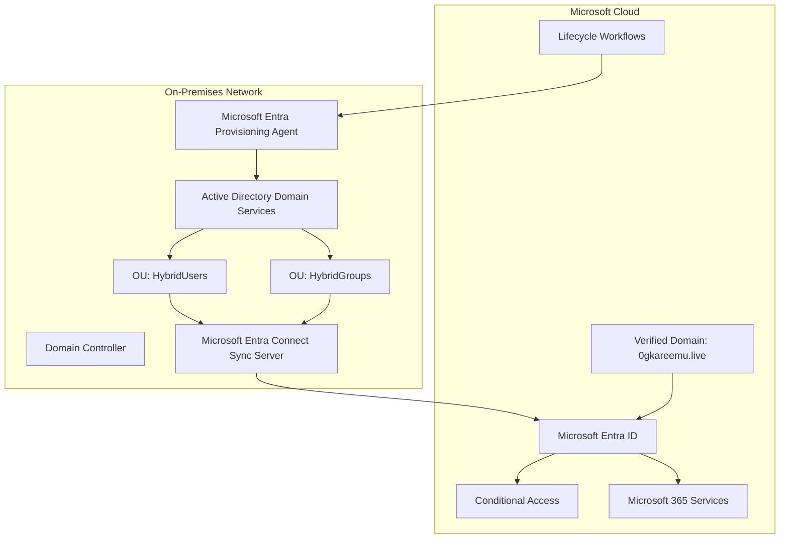
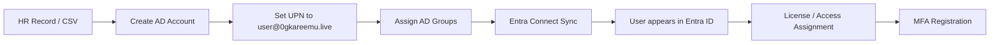
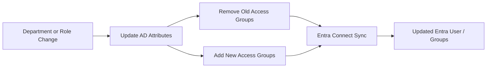
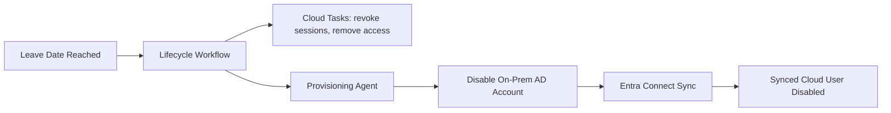

# Hybrid Identity Architecture

## Architecture Goal

The goal of this lab is to design and document a hybrid identity environment where Active Directory remains the primary identity source, while Microsoft Entra ID is used for cloud authentication, access control, governance, and lifecycle automation.

The architecture uses:

- On-premises Active Directory Domain Services.
- A verified Microsoft Entra custom domain: `0gkareemu.live`.
- Microsoft Entra Connect Sync for directory synchronization.
- Microsoft Entra provisioning agent for supported on-premises Lifecycle Workflow actions.
- Microsoft Entra ID Governance for lifecycle automation.

---

## Logical Architecture



---

## Identity Source of Truth

In this design, Active Directory is the source of truth for core workforce identity attributes.

| Attribute | Source | Notes |
|---|---|---|
| `givenName` | AD / HR process | First name |
| `sn` | AD / HR process | Surname |
| `displayName` | AD / HR process | Full display name |
| `userPrincipalName` | AD | Must use `@0gkareemu.live` |
| `mail` | AD / Exchange attributes | Should match primary email where possible |
| `department` | AD / HR process | Used for group and access logic |
| `jobTitle` | AD / HR process | Used for role mapping |
| `manager` | AD / HR process | Used for approvals and workflows |
| `employeeId` | HR / AD | Unique employee reference |
| `employeeType` | HR / AD | Employee, contractor, guest, etc. |
| `employeeHireDate` | HR / AD | Joiner automation attribute |
| `employeeLeaveDateTime` | HR / AD | Leaver automation attribute where supported |
| `accountEnabled` | AD | On-premises account status |

---

## Domain and UPN Design

### Cloud domain

The lab uses the verified custom domain:

```text
0gkareemu.live
```

This domain is used for user sign-in and cloud identity consistency.

### AD UPN suffix

The same suffix is added to Active Directory so users can have a cloud-ready UPN.

Example:

```text
Local AD domain:       ad.iamhomelab.local
Cloud sign-in domain:  0gkareemu.live
User UPN:              jane.doe@0gkareemu.live
```

This avoids users signing into Microsoft 365 with an internal or non-routable domain.

---

## Recommended OU Design

```text
ad.iamhomelab.local
│
├── OU=IAM-Lab
│   ├── OU=Users
│   │   ├── OU=Employees
│   │   ├── OU=Contractors
│   │   └── OU=Leavers
│   │
│   ├── OU=Groups
│   │   ├── OU=Role-Groups
│   │   ├── OU=Access-Groups
│   │   └── OU=License-Groups
│   │
│   ├── OU=Service-Accounts
│   │
│   └── OU=Workstations
```

---

## Synchronization Scope

Only selected OUs should be synchronized to Microsoft Entra ID.

| OU | Sync? | Reason |
|---|---:|---|
| `OU=Employees` | Yes | Active workforce users |
| `OU=Contractors` | Yes | Contractor lifecycle testing |
| `OU=Leavers` | Optional | Depends on retention and disablement design |
| `OU=Role-Groups` | Yes | Used for RBAC and access assignment |
| `OU=Access-Groups` | Yes | Used for application/resource access |
| `OU=License-Groups` | Yes | Used for group-based licensing |
| `OU=Service-Accounts` | No | Avoid accidental cloud exposure |
| `OU=Workstations` | No | Not needed for user lifecycle lab |

---

## Data Flow

### Joiner flow



### Mover flow



### Leaver flow



---

## Entra Connect Sync Placement

The Microsoft Entra Connect Sync server should be:

- Domain joined.
- Secured as a high-value identity system.
- Restricted to authorised administrators.
- Monitored for sync health.
- Excluded from general-purpose workloads.
- Backed up or documented so it can be rebuilt.

Recommended server name:

```text
HYB-SYNC-01
```

---

## Provisioning Agent Placement

The Microsoft Entra provisioning agent should be installed on a server that has network connectivity to the domain controller and can communicate outbound to Microsoft Entra services.

Recommended server name:

```text
HYB-AGENT-01
```

In a small lab, Entra Connect Sync and the provisioning agent may run on the same server for simplicity. In production, separation should be considered based on security, performance, and operational requirements.

---

## Security Controls

| Control | Purpose |
|---|---|
| Dedicated service accounts | Avoid using personal admin accounts for sync/provisioning |
| Least privilege | Grant only required permissions |
| OU scoping | Prevent accidental cloud sync of unwanted objects |
| MFA for administrators | Protect cloud administration |
| Break-glass accounts | Prevent tenant lockout |
| Sync health monitoring | Detect synchronization failures early |
| Audit logs | Track identity changes |
| Restricted server access | Protect identity infrastructure |

---

## Risks and Mitigations

| Risk | Impact | Mitigation |
|---|---|---|
| Wrong UPN suffix | Users cannot sign in cleanly | Use verified domain `0gkareemu.live` as AD UPN suffix |
| Duplicate UPN or proxy address | Sync failure | Validate uniqueness before sync |
| Accidental sync of service accounts | Security exposure | Use OU filtering |
| Sync server compromise | High identity risk | Treat sync server as Tier 0 |
| Provisioning agent unhealthy | Lifecycle actions fail | Monitor agent health |
| Leaver not disabled on-prem | Continued access risk | Use workflow evidence and sync validation |
| Attribute not syncing | Workflow does not trigger | Confirm attribute flow and sync rules |

---

## Architecture Outcome

This architecture provides a realistic hybrid identity foundation where:

- AD remains the authoritative identity source.
- Entra ID provides cloud authentication and governance.
- Custom UPN alignment improves the user sign-in experience.
- Entra Connect Sync keeps identities consistent between AD and cloud.
- Lifecycle Workflows can automate selected on-prem and cloud leaver actions.
