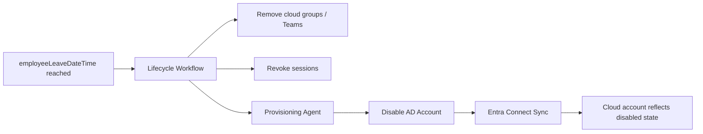

# Microsoft Entra Connect Sync Configuration

## Purpose

This document describes how Microsoft Entra Connect Sync was configured in the hybrid identity lab to synchronize on-premises Active Directory users and groups into Microsoft Entra ID.

The configuration supports:

- Hybrid identity for Microsoft 365 access.
- Custom domain sign-in using `0gkareemu.live`.
- Scoped synchronization of lab users and groups.
- Cloud governance through Microsoft Entra ID.
- Lifecycle Workflow processing for synchronized users.

---

## Prerequisites

Before configuring Entra Connect Sync, the following prerequisites should be completed.

### Microsoft Entra prerequisites

- Microsoft Entra tenant available.
- Custom domain `0gkareemu.live` added and verified.
- Hybrid Identity Administrator or Global Administrator access available for setup.
- Test users and groups planned.
- Licensing available for Entra ID Governance features if Lifecycle Workflows are being tested.

### Active Directory prerequisites

- Domain controller online and healthy.
- DNS resolution working correctly.
- AD UPN suffix `0gkareemu.live` added.
- Test users created in scoped OUs.
- User UPNs set to `@0gkareemu.live`.
- Duplicate UPNs and duplicate email/proxy values checked.

### Server prerequisites

- Windows Server joined to the AD domain.
- Network connectivity to the domain controller.
- Outbound internet connectivity to Microsoft Entra services.
- Admin account available for installation.
- Time synchronization working.
- TLS inspection/proxy issues reviewed if present.

---

## Custom Domain Verification

The custom domain must be added to the Microsoft Entra tenant before users can sign in with that domain.

Domain used:

```text
0gkareemu.live
```

Expected result:

```text
Domain status: Verified
```

Evidence to capture:

- Screenshot of domain list in Microsoft Entra admin center.
- Screenshot showing `0gkareemu.live` as verified.

---

## AD UPN Suffix Configuration

The custom domain should be added as an alternative UPN suffix in Active Directory.

### GUI method

1. Open **Active Directory Domains and Trusts**.
2. Right-click **Active Directory Domains and Trusts**.
3. Select **Properties**.
4. Add the UPN suffix:

```text
0gkareemu.live
```

5. Apply the change.

### PowerShell validation

```powershell
Get-ADForest | Select-Object -ExpandProperty UPNSuffixes
```

Expected output includes:

```text
0gkareemu.live
```

---

## Test User Preparation

Example test user attributes:

```powershell
Get-ADUser john.smith -Properties UserPrincipalName,Mail,Department,Title,Manager | 
Select-Object Name,UserPrincipalName,Mail,Department,Title,Manager
```

Expected values:

| Attribute | Example |
|---|---|
| `Name` | John Smith |
| `UserPrincipalName` | `john.smith@0gkareemu.live` |
| `mail` | `john.smith@0gkareemu.live` |
| `department` | IT |
| `title` | Service Desk Analyst |
| `manager` | Populated where applicable |

---

## Entra Connect Sync Installation Mode

For this lab, the recommended configuration is **custom installation** rather than express installation.

Custom installation is preferred because it allows:

- OU filtering.
- Sign-in method selection.
- Attribute and feature review.
- Safer lab scoping.
- Better documentation of design decisions.

---

## Sign-In Method

For a lab, the sign-in method can be selected based on the scenario being tested.

| Method | Use Case |
|---|---|
| Password Hash Synchronization | Common and simple hybrid sign-in method |
| Pass-through Authentication | Validates passwords directly against on-prem AD |
| Federation | More complex, usually for specific enterprise requirements |

Recommended lab option:

```text
Password Hash Synchronization
```

Reason:

- Easier to deploy in a lab.
- Supports cloud authentication.
- Good enough for demonstrating hybrid identity and Microsoft 365 access.

---

## OU Filtering

Only the lab OUs should be included in sync scope.

Recommended included OUs:

```text
OU=Employees,OU=Users,OU=IAM-Lab,DC=ad,DC=iamhomelab,DC=local
OU=Contractors,OU=Users,OU=IAM-Lab,DC=ad,DC=iamhomelab,DC=local
OU=Role-Groups,OU=Groups,OU=IAM-Lab,DC=ad,DC=iamhomelab,DC=local
OU=Access-Groups,OU=Groups,OU=IAM-Lab,DC=ad,DC=iamhomelab,DC=local
OU=License-Groups,OU=Groups,OU=IAM-Lab,DC=ad,DC=iamhomelab,DC=local
```

Excluded OUs:

```text
OU=Service-Accounts,OU=IAM-Lab,DC=ad,DC=iamhomelab,DC=local
OU=Workstations,OU=IAM-Lab,DC=ad,DC=iamhomelab,DC=local
```

---

## Sync Validation Commands

### Start delta sync

```powershell
Start-ADSyncSyncCycle -PolicyType Delta
```

### Start initial sync

```powershell
Start-ADSyncSyncCycle -PolicyType Initial
```

### Check scheduler

```powershell
Get-ADSyncScheduler
```

### Check connector run history

Open:

```text
Synchronization Service Manager
```

Review:

- Import from AD connector.
- Synchronization step.
- Export to Microsoft Entra connector.
- Export errors.

---

## Expected Sync Result

In Microsoft Entra ID, synced users should show:

| Field | Expected Result |
|---|---|
| User principal name | `user@0gkareemu.live` |
| On-premises sync enabled | Yes |
| Source | Windows Server AD / Synced from on-premises |
| Account enabled | Matches on-prem AD state after sync |
| Department | Synced from AD |
| Job title | Synced from AD |
| Manager | Synced where configured and in scope |

---

## Example Sync Test

### Test case: New AD user appears in Microsoft Entra ID

1. Create user in AD under scoped OU.
2. Set UPN to `@0gkareemu.live`.
3. Populate department and job title.
4. Add user to required AD groups.
5. Run delta sync.
6. Confirm user appears in Entra ID.
7. Confirm the user has `On-premises sync enabled: Yes`.
8. Confirm group memberships are synchronized.
9. Confirm user can complete sign-in and MFA registration if required.

Expected result:

```text
PASS - User synchronized successfully to Microsoft Entra ID.
```

---

## Group Synchronization Design

Groups are synchronized from AD to Entra ID to support access management.

Example groups:

| AD Group | Purpose |
|---|---|
| `GG_IT_Users` | Department role group |
| `GG_Finance_Users` | Department role group |
| `GG_HR_Users` | Department role group |
| `DL_M365_E3_License` | License assignment group |
| `GG_App_ServiceDesk_Access` | Application access group |
| `GG_App_FinancePortal_Access` | Application access group |

---

## Lifecycle Workflow Integration

Lifecycle Workflows can process users synchronized from AD when the required attributes and scope conditions are met.

For cloud-only tasks, the workflow acts directly in Microsoft Entra ID.

For supported on-premises account actions, the workflow depends on the Microsoft Entra provisioning agent.

Example leaver workflow:



---

## Provisioning Agent Notes

The provisioning agent provides connectivity between Microsoft Entra ID and the on-premises environment. In this lab, it is included to support lifecycle operations for synchronized users.

Recommended checks:

- Agent installed successfully.
- Agent visible and healthy in Microsoft Entra admin center.
- Server has connectivity to domain controller.
- Service account permissions are correct.
- Lifecycle Workflow task is configured for synchronized users where applicable.

---

## Evidence Checklist

| Evidence | Screenshot Name |
|---|---|
| Verified domain | `01-entra-custom-domain-verified.png` |
| AD UPN suffix | `02-ad-upn-suffix.png` |
| AD test user UPN | `03-ad-user-upn.png` |
| Entra Connect OU filtering | `04-entra-connect-ou-filtering.png` |
| Sync Service successful export | `05-sync-service-export-success.png` |
| Entra synced user | `06-entra-synced-user.png` |
| Provisioning agent healthy | `07-provisioning-agent-health.png` |
| Lifecycle Workflow config | `08-lifecycle-workflow-config.png` |
| Disabled user result | `09-leaver-disabled-user.png` |

---

## Success Criteria

The Entra Connect Sync configuration is successful when:

- The custom domain is verified.
- AD users use the verified domain as their UPN suffix.
- Scoped AD users synchronize to Microsoft Entra ID.
- Users appear as synced, not cloud-only.
- Group memberships synchronize correctly.
- Changes made in AD flow to Entra ID after delta sync.
- Lifecycle Workflow tests can identify synchronized users.
- Supported on-premises account actions work through the provisioning agent.
