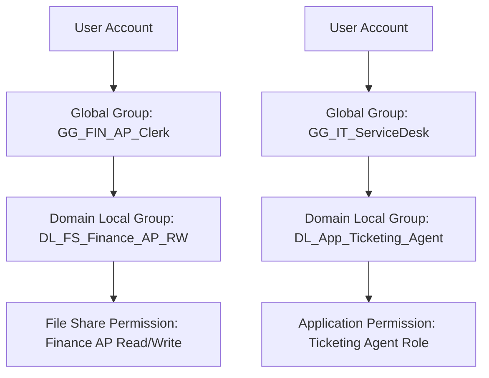

# 03 - RBAC and AGDLP Access Model

## Project Summary

This project demonstrates a practical **Role-Based Access Control (RBAC)** design using the **AGDLP model** in a hybrid identity environment.

The goal of this project is to show how user access can be assigned in a controlled, auditable and scalable way using:

- On-premises Active Directory groups
- Microsoft Entra ID synced identities
- Department and job-role based access
- Group naming standards
- Access request and approval workflows
- Least privilege principles
- Joiner, Mover and Leaver alignment

This project is designed as a portfolio-ready IAM artefact for demonstrating how access can be structured in a real organisation instead of assigning permissions directly to individual users.

---

## Scenario

The organisation uses a hybrid identity environment:

- **Active Directory** is the primary identity source for workforce accounts.
- **Microsoft Entra ID** provides cloud identity, authentication and Microsoft 365 access.
- Users are created in AD and synced to Entra ID using Entra Connect Sync.
- Access to file shares and on-premises resources is controlled using AD groups.
- Access to cloud applications is controlled using Entra security groups and Microsoft 365 groups.

The IAM design must support:

- New starters receiving correct baseline access
- Movers losing old access before receiving new access
- Leavers having access removed quickly and consistently
- Managers approving access requests
- Service Desk following a clear operational process
- Audit teams reviewing who has access and why

---

## What This Project Demonstrates

This project demonstrates the following IAM skills:

| Skill Area | Demonstrated By |
|---|---|
| RBAC design | Mapping job roles to approved access levels |
| AGDLP | Separating users, role groups, resource groups and permissions |
| Least privilege | Users receive only role-required access |
| Access governance | Access requests require approval and business justification |
| Hybrid identity | AD groups support on-prem resources and synced access patterns |
| Service Desk readiness | Clear request, fulfilment and evidence process |
| Auditability | Access can be reviewed using group membership and approval records |

---

## AGDLP Model Used

This project follows the AGDLP model:

```text
A  = Accounts
G  = Global Groups
DL = Domain Local Groups
P  = Permissions
```

Simple explanation:

```text
User Account
   ↓
Role-based Global Group
   ↓
Resource-based Domain Local Group
   ↓
Permission on File Share / Application / Resource
```

Example:

```text
User: Jane Smith
   ↓
GG_FIN_AP_Clerk
   ↓
DL_FS_Finance_AP_RW
   ↓
Read/Write access to \\fileserver\Finance\AccountsPayable
```

This avoids assigning permissions directly to users and makes access easier to manage, audit and remove.

---

## Repository Structure

```text
03-rbac-agdlp-access-model/
├── README.md
├── rbac-role-matrix.md
├── group-naming-standard.md
├── access-request-flow.md
└── screenshots/
    ├── README.md
    └── .gitkeep
```

---

## Target Environment

| Component | Example |
|---|---|
| AD domain | ad.iamhomelab.com |
| Verified Entra domain | 0gkareemu.live |
| Identity source | On-premises AD |
| Cloud directory | Microsoft Entra ID |
| Sync method | Entra Connect Sync |
| Access model | RBAC with AGDLP |
| Resources | File shares, Microsoft 365, SaaS apps, admin roles |

---

## Access Design Principles

The design follows these principles:

1. **No direct user permissions**  
   Access is granted using groups only.

2. **Role-based default access**  
   Users receive baseline access based on department and job role.

3. **Resource-based permission groups**  
   Permissions are attached to resource groups, not role groups.

4. **Separation of duties**  
   High-risk access requires additional approval.

5. **Least privilege**  
   Users receive only the access required for their role.

6. **Mover cleanup first**  
   Old department access is removed before new access is granted.

7. **Leaver removal is priority**  
   Access removal is treated as a security control, not an admin task.

8. **Everything must be auditable**  
   Every access change should have a request, approval and evidence trail.

---

## Example Access Model

| User Attribute | Drives Access |
|---|---|
| Department | Baseline department access |
| Job Title | Role-specific access |
| Location | Site-specific access |
| Manager | Approval routing |
| Employment Status | Joiner, mover and leaver controls |
| Privileged Role | PIM or separate admin access process |

---

## Example Group Flow



---

## Example Joiner Outcome

A new Finance Accounts Payable Clerk joins the organisation.

The user is added to:

```text
GG_FIN_Baseline
GG_FIN_AP_Clerk
GG_M365_StandardUser
```

The role group then grants access through resource groups:

```text
DL_FS_Finance_General_R
DL_FS_Finance_AP_RW
DL_App_ERP_AP_User
```

The user receives:

- Finance general read access
- Accounts Payable read/write access
- ERP Accounts Payable role
- Standard Microsoft 365 access

---

## Example Mover Outcome

A user moves from Finance to HR.

Old access removed:

```text
GG_FIN_Baseline
GG_FIN_AP_Clerk
```

New access added:

```text
GG_HR_Baseline
GG_HR_Advisor
```

This prevents access accumulation, also known as privilege creep.

---

## Example Leaver Outcome

When a user leaves:

- AD account is disabled
- User is removed from role groups
- Microsoft 365 sessions are revoked
- Licences are removed where appropriate
- Mailbox and OneDrive retention process begins
- Group membership export is saved as evidence

---

## Files in This Project

| File | Purpose |
|---|---|
| `rbac-role-matrix.md` | Maps departments and job roles to approved access groups |
| `group-naming-standard.md` | Defines a consistent naming convention for AD and Entra groups |
| `access-request-flow.md` | Documents how access is requested, approved, fulfilled and reviewed |
| `screenshots/` | Placeholder for lab screenshots and evidence |

---

## Suggested Screenshots to Add

Add screenshots showing:

- AD OU structure
- Example AD security groups
- Group nesting showing AGDLP
- Example user group membership
- Entra ID synced user
- Entra ID synced group
- Access request ticket example
- File share permission showing Domain Local group assignment
- Before and after mover access comparison
- Leaver group membership removal evidence

---

## Interview Talking Points

This project can be explained in interviews as:

> I designed a hybrid RBAC access model using the AGDLP principle. Instead of assigning permissions directly to users, I mapped job roles to global groups, nested those groups into resource-based permission groups, and applied permissions only to the resource groups. This makes access easier to audit, request, approve, remove and automate during Joiner, Mover and Leaver processes.

Strong points to mention:

- You understand access control design, not just user administration.
- You know why direct user permissions are risky.
- You can design access around business roles.
- You understand privilege creep during mover processes.
- You can support audit, compliance and Service Desk operations.
- You can align RBAC with JML lifecycle management.

---

## Status

This is a portfolio lab project. It can be extended with:

- PowerShell group creation scripts
- CSV-based access matrix import
- Entra dynamic group design
- Access review evidence
- Entitlement Management access packages
- PIM role activation workflow
