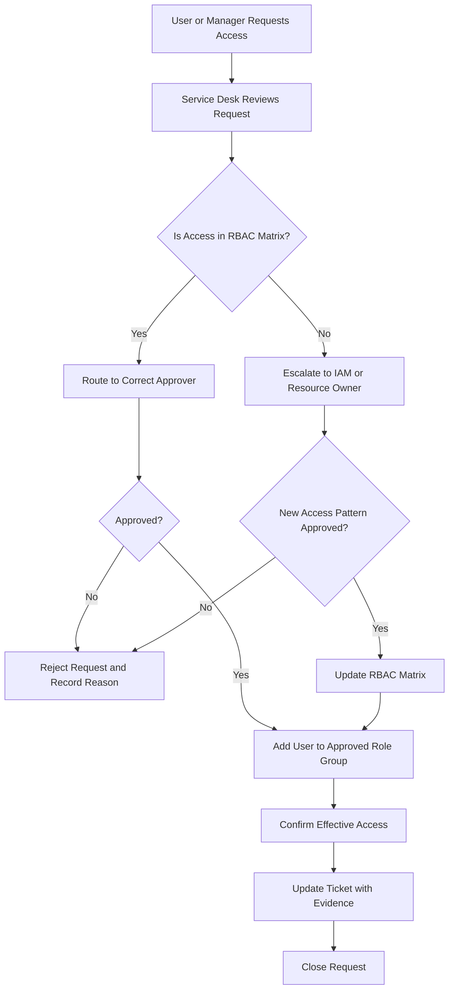
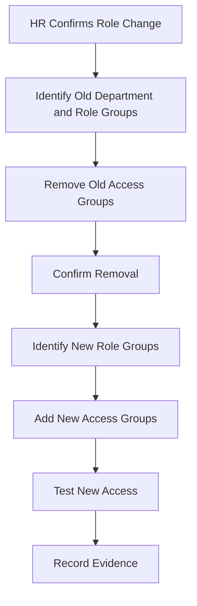
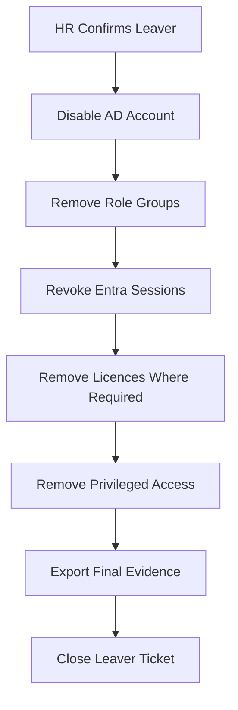

# Access Request Flow

## Purpose

This document defines the access request and approval process for the RBAC and AGDLP access model.

The purpose is to make sure access is:

- Requested with a valid business reason
- Approved by the correct owner
- Granted using the correct group
- Tested after fulfilment
- Recorded for audit evidence
- Reviewed periodically
- Removed when no longer needed

---

## Access Request Principles

1. Access must be granted through groups, not direct permissions.
2. Access must be linked to a business role or approved exception.
3. The requester must provide a reason for access.
4. The correct owner must approve the request.
5. Sensitive access needs stronger approval.
6. Temporary access must have an expiry date.
7. Privileged access must use PIM where possible.
8. All changes must be auditable.

---

## Standard Access Request Flow



---

## Request Information Required

Every request must include:

| Field | Required | Example |
|---|---:|---|
| User name | Yes | Aisha Bello |
| User account/UPN | Yes | aisha.bello@0gkareemu.live |
| Department | Yes | Finance |
| Job title | Yes | Accounts Payable Clerk |
| Manager | Yes | Finance Manager |
| Requested access | Yes | Finance AP folder access |
| Business justification | Yes | Required to process supplier invoices |
| Access duration | Yes | Permanent or temporary |
| Expiry date | Conditional | Required for temporary access |
| Approver | Yes | Finance Manager |
| Ticket/reference number | Yes | INC/REQ number |

---

## Access Types

### 1. Standard Role-Based Access

Used when the user needs access already defined in the RBAC matrix.

Example:

```text
Finance AP Clerk requires access to Finance AP share and ERP AP module.
```

Process:

1. Confirm user job role.
2. Confirm access exists in RBAC matrix.
3. Get line manager or department owner approval.
4. Add user to the correct role group.
5. Confirm access works.
6. Update ticket with evidence.

---

### 2. Additional Access

Used when the user needs access outside their default role.

Example:

```text
HR Advisor needs temporary read access to Finance payroll reports.
```

Process:

1. Confirm business reason.
2. Confirm whether this creates a separation-of-duties risk.
3. Get approval from both current manager and resource owner.
4. Add user to approved group.
5. Set expiry date where possible.
6. Record as exception.
7. Include in next access review.

---

### 3. Sensitive Access

Used for access to payroll, HR case files, financial systems, privileged admin tools or confidential data.

Process:

1. Require strong business justification.
2. Require resource owner approval.
3. Require manager approval.
4. Require IAM/Security review if privileged.
5. Use time-bound access where possible.
6. Record evidence in ticket.
7. Review monthly.

---

### 4. Privileged Access

Used for administrator roles such as User Administrator, Groups Administrator, Conditional Access Administrator or application administrator.

Process:

1. Confirm the admin task.
2. Confirm role required.
3. Assign eligible access through PIM where possible.
4. Require MFA on activation.
5. Require justification.
6. Require approval for high-risk roles.
7. Review audit logs after activation.

---

## Approval Matrix

| Access Type | Approver |
|---|---|
| Department baseline access | Line Manager |
| File share access | Data Owner |
| Application access | Application Owner |
| Finance/payroll access | Finance Manager + HR where required |
| HR case file access | HR Manager |
| VPN access | Line Manager + IT/Security |
| Privileged admin access | IAM/Security Manager |
| Temporary exception access | Resource Owner + Line Manager |
| Guest access | Sponsor + Resource Owner |

---

## Service Desk Fulfilment Steps

### Step 1: Validate Request

Check:

- User identity
- Requester identity
- Business reason
- Correct approval
- Correct group from RBAC matrix
- Whether access is permanent or temporary

---

### Step 2: Identify Correct Group

Use the RBAC matrix to identify the correct group.

Example:

| Request | Correct Group |
|---|---|
| Finance AP read/write access | `GG_FIN_AP_Clerk` |
| HR case file access | `GG_HR_Advisor` |
| Service Desk ticketing access | `GG_IT_ServiceDesk` |
| VPN access | `GG_NET_VPN_Users` |
| ERP Finance access | `GG_FIN_AP_Clerk` or app-specific group |

---

### Step 3: Apply Group Membership

Example PowerShell command:

```powershell
Add-ADGroupMember -Identity "GG_FIN_AP_Clerk" -Members "aisha.bello"
```

For Entra-only groups, use the Entra admin centre or Microsoft Graph/PowerShell if approved.

---

### Step 4: Confirm Access

Validation checks:

- User appears in correct role group
- Role group is nested into correct resource group
- Resource group has correct permission
- User can access required resource after token refresh/sign-in
- No unnecessary access was added

---

### Step 5: Record Evidence

Ticket evidence should include:

```text
Access granted to: aisha.bello@0gkareemu.live
Approved by: Finance Manager
Group added: GG_FIN_AP_Clerk
Date/time: YYYY-MM-DD HH:MM
Implemented by: Service Desk/IAM Analyst
Validation: User confirmed access to Finance AP share
Review date: Quarterly department review
```

---

## Mover Access Flow



### Mover Rule

Old access must be removed before new access is granted.

This prevents privilege creep.

---

## Leaver Access Flow



### Leaver Evidence Required

- AD account disabled
- User removed from role groups
- Entra sessions revoked
- Privileged roles removed
- Licence removal or retention confirmed
- Mailbox/OneDrive retention process started

---

## Emergency Access Request

Emergency access may be required during incidents.

Rules:

1. Emergency access must be time-bound.
2. Approval must be obtained from an incident manager, system owner or security lead.
3. Access must be reviewed after the incident.
4. Access must be removed immediately after use.
5. Evidence must be recorded in the incident ticket.

Example:

```text
Temporary access granted to restore failed application service.
Approved by: Incident Manager
Expiry: Same day
Post-incident review required: Yes
```

---

## Rejection Reasons

Access requests should be rejected when:

- No valid business reason is provided
- Approver is not authorised
- User already has equivalent access
- Request violates separation of duties
- Requested access is too broad
- Temporary access has no expiry date
- Resource owner cannot confirm need

---

## Audit Evidence Checklist

For each access request, keep evidence of:

- [ ] Requester
- [ ] Target user
- [ ] Requested access
- [ ] Business justification
- [ ] Approver
- [ ] Approval timestamp
- [ ] Group added or removed
- [ ] Implementation timestamp
- [ ] Implementer
- [ ] Validation result
- [ ] Expiry date if temporary
- [ ] Ticket reference

---

## Example Ticket Note

```text
Access request completed.

User: Aisha Bello
UPN: aisha.bello@0gkareemu.live
Department: Finance
Requested access: Finance AP read/write access
Approved by: Finance Manager
Group added: GG_FIN_AP_Clerk
Access path: GG_FIN_AP_Clerk > DL_FS_Finance_AP_RW > \\fileserver\Finance\AccountsPayable
Validation: User confirmed access after signing out and back in.
Implemented by: IAM/Service Desk
Date: YYYY-MM-DD
Review cycle: Quarterly Finance access review
```

---

## Access Review Process

Access reviews should confirm:

- Does the user still need the access?
- Is the user still in the same role?
- Is the user still employed or active?
- Is the access still appropriate?
- Is any access excessive or duplicated?
- Is temporary access expired?
- Is privileged access justified?

---

## Success Criteria

The access request process is successful when:

- Service Desk can fulfil standard access without guessing
- Managers approve only access they own
- IAM can trace every access grant to a request
- Users do not accumulate old access after moving roles
- Leaver access is removed quickly
- Audit evidence is available for each access change
