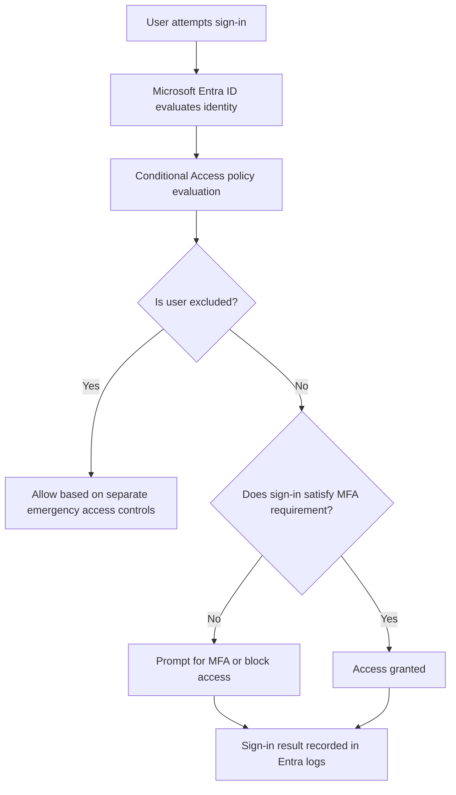

# 04 - Conditional Access & Zero Trust: MFA Enforcement for All Users

## Project Summary

This project demonstrates how to design, implement, test, and document a Microsoft Entra Conditional Access policy that enforces multifactor authentication (MFA) for all users while protecting the tenant from accidental lockout.

The goal is not only to enable MFA, but to show an enterprise-ready Zero Trust approach where identity, risk, authentication strength, emergency access, monitoring, and rollout control are considered before enforcement.

## Business Problem

A Microsoft 365 tenant without consistent MFA enforcement is exposed to password spray, credential stuffing, phishing, and account takeover attacks. In many organisations, MFA may be enabled for some administrators or high-risk users, but not applied consistently across the workforce.

This creates several risks:

- Standard users can access Microsoft 365 using only a password.
- Privileged users may be targeted because of elevated access.
- Legacy authentication can bypass modern MFA controls.
- Poorly planned Conditional Access policies can lock out administrators.
- Service accounts and emergency access accounts may break if not handled correctly.

## Project Objective

Design a Conditional Access baseline that:

- Requires MFA for all internal users.
- Uses report-only mode before enforcement.
- Excludes approved emergency access accounts from normal Conditional Access restrictions.
- Applies stronger authentication to administrators.
- Blocks legacy authentication where appropriate.
- Provides test evidence before and after enforcement.
- Aligns with Zero Trust principles: verify explicitly, use least privilege, and assume breach.

## Environment

| Component | Example Used in Lab |
|---|---|
| Identity platform | Microsoft Entra ID |
| Directory model | Cloud or hybrid AD + Entra ID |
| Licensing assumption | Microsoft Entra ID P1/P2 |
| Admin portal | Microsoft Entra admin center |
| Test users | Standard user, admin user, break-glass account |
| Target apps | Microsoft 365 / Office 365 cloud apps |
| Authentication methods | Microsoft Authenticator, FIDO2/passkey, Temporary Access Pass where approved |

## Repository Structure

```text
04-conditional-access-zero-trust/
├── README.md
├── policy-design.md
├── break-glass-strategy.md
├── test-evidence.md
└── screenshots/
    ├── README.md
    └── .gitkeep
```

## Conditional Access Policies Designed

| Policy ID | Policy Name | Purpose | Initial State |
|---|---|---|---|
| CA-001 | Require MFA for All Users | Enforce MFA for standard workforce access | Report-only, then On |
| CA-002 | Require Strong MFA for Admin Roles | Require stronger MFA for privileged access | Report-only, then On |
| CA-003 | Block Legacy Authentication | Prevent non-modern authentication bypass | Report-only, then On |
| CA-004 | Require MFA for Security Info Registration | Protect MFA registration and reset process | Report-only, then On |

## Main Policy: MFA for All Users

### Assignments

| Setting | Value |
|---|---|
| Users | All users |
| Exclusions | Break-glass accounts, approved service accounts where required |
| Target resources | All cloud apps or selected Microsoft 365 apps during pilot |
| Conditions | All locations, all supported client apps |
| Grant control | Require multifactor authentication or require authentication strength |
| Session controls | Sign-in frequency can be added after baseline testing |
| Policy state | Report-only first, then On after successful validation |

## High-Level Design



## Rollout Approach

The policy is rolled out in phases to reduce business disruption.

| Phase | Scope | Policy State | Success Criteria |
|---|---|---|---|
| 1 | IT test users only | Report-only | No unexpected blocks |
| 2 | Pilot department | Report-only | MFA prompts behave as expected |
| 3 | All users | Report-only | No service account or break-glass impact |
| 4 | All users | On | Users must complete MFA successfully |
| 5 | Monitoring | On | Failed sign-ins and user impact reviewed |

## Key Security Decisions

### 1. Use Conditional Access instead of per-user MFA

Conditional Access provides better control because enforcement can be based on users, groups, applications, roles, locations, device state, sign-in risk, and authentication strength.

### 2. Exclude break-glass accounts from normal Conditional Access policies

Emergency accounts are excluded from normal Conditional Access policies to prevent a full tenant lockout during misconfiguration or authentication service issues. These accounts must still be protected using strong credentials, phishing-resistant MFA where required, monitoring, secure storage, and regular testing.

### 3. Start with report-only mode

Report-only mode allows the impact of the policy to be assessed before users are blocked or forced through new controls.

### 4. Use stronger controls for administrators

Privileged users should have stronger requirements than standard users because their accounts can modify tenant-wide security settings.

## Evidence to Capture

Store screenshots in the `screenshots/` folder.

Recommended screenshots:

- Conditional Access policy list.
- CA-001 policy assignments.
- CA-001 grant controls.
- Report-only sign-in log showing expected policy result.
- Successful standard user sign-in with MFA.
- Failed or interrupted sign-in where MFA was not completed.
- Break-glass account exclusion evidence.
- Admin MFA policy evidence.
- Legacy authentication block evidence.

## Interview Talking Points

Use this project to explain:

- Why MFA should be enforced through Conditional Access.
- Why break-glass accounts must be treated differently from standard users.
- How to avoid locking out the tenant.
- How report-only mode helps validate policy impact.
- How Conditional Access supports Zero Trust.
- How to test policy behaviour using sign-in logs and the What If tool.
- How to design different MFA requirements for standard users and administrators.

## Real-World Outcome

This project shows that I can design an IAM security control, assess business impact, safely deploy it, test it, and produce clear operational evidence. It demonstrates practical Microsoft Entra skills that are directly relevant to IAM Analyst, Identity Administrator, and Identity & Access Engineer roles.

## References

- Microsoft Learn - Microsoft Entra Conditional Access overview: https://learn.microsoft.com/en-us/entra/identity/conditional-access/overview
- Microsoft Learn - Require MFA for all users with Conditional Access: https://learn.microsoft.com/en-us/entra/identity/conditional-access/policy-all-users-mfa-strength
- Microsoft Learn - Plan a Conditional Access deployment: https://learn.microsoft.com/en-us/entra/identity/conditional-access/plan-conditional-access
- Microsoft Learn - Conditional Access report-only mode: https://learn.microsoft.com/en-us/entra/identity/conditional-access/concept-conditional-access-report-only
- Microsoft Learn - Manage emergency access accounts: https://learn.microsoft.com/en-us/entra/identity/role-based-access-control/security-emergency-access
